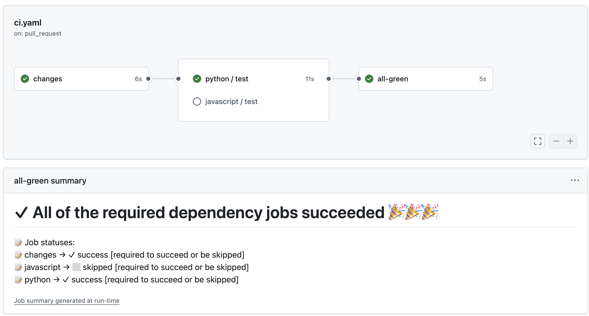
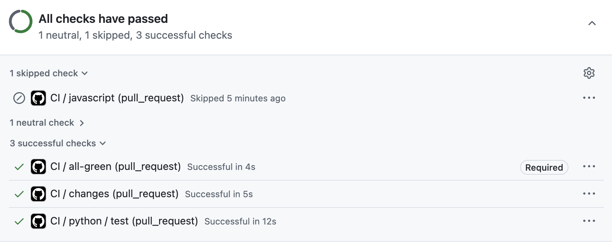

# Monorepo CI: Solving GitHub Actions Path Filtering Issues

## 🫠 Typical Problematic Setup

Most monorepos use separate workflows with paths filtering like this:

```yaml
# .github/workflows/javascript.yaml
name: JavaScript CI
on:
  pull_request:
    paths:
      - 'js/**'
jobs:
  test:
    runs-on: ubuntu-latest
    steps:
      - uses: actions/checkout@v4
      - name: Run JS tests
        run: npm test
```

```yaml
# .github/workflows/python.yaml  
name: Python CI
on:
  pull_request:
    paths:
      - 'python/**'
jobs:
  test:
    runs-on: ubuntu-latest
    steps:
      - uses: actions/checkout@v4
      - name: Run Python tests
        run: pytest
```

## 🔍 The Problems

This approach creates two fundamental issues:

### 1. No "All CI Passed" Status

GitHub Actions has no built-in concept of "all CI passed" status. When a workflow doesn't run due to paths filtering, GitHub cannot distinguish between:
- **Intentionally skipped** (no relevant files changed)
- **Not started yet** (workflow pending)  
- **CI system broken** (workflow failed to trigger)

### 2. Incompatibility with Protection Systems

Merge Protection systems require explicitly listing every CI job:
- **GitHub Branch Protection Rules**: Must specify each workflow/job name
- **Mergify Merge Protections**: Must list all required status checks
- **Merge Queue Systems**: Need to know which checks to wait for

When using paths filtering, workflows don't run for unrelated changes, causing protection systems to fail because they're waiting for checks that will never report.

## 🧨 Common Bad Workarounds

Teams often try these problematic approaches to solve the issue:

### Remove All Paths Filtering

```yaml
# Remove paths filtering entirely
name: JavaScript CI
on:
  pull_request:  # No paths filter
```

**Problems**: 
- Wastes CI resources running unnecessary tests
- Increases build times and costs
- Still works, but very inefficient

### Always Create Dummy Success Jobs

```yaml
name: JavaScript CI
on:
  pull_request:  # No paths filtering - always run

jobs:
  check-changes:
    runs-on: ubuntu-latest
    outputs:
      should-run: ${{ steps.changes.outputs.js }}
    steps:
      - uses: actions/checkout@v4
      - uses: dorny/paths-filter@v3
        id: changes
        with:
          filters: |
            js:
              - 'js/**'
  
  test:
    needs: check-changes
    runs-on: ubuntu-latest
    steps:
      - name: Skip if no changes
        if: ${{ needs.check-changes.outputs.should-run != 'true' }}
        run: echo "No changes, skipping tests"
      - name: Run tests
        if: ${{ needs.check-changes.outputs.should-run == 'true' }}
        run: npm test
```

**Problems**:
- Every workflow must always run (wasting runner time)
- Complex conditional logic duplicated in every workflow
- Still wastes CI resources for change detection jobs
- Brittle and hard to maintain across multiple workflows

### Use External Status Checks

Some teams create external services that monitor GitHub API and create artificial status checks.

**Problems**:
- Adds infrastructure complexity
- Requires additional services and maintenance
- Potential security concerns
- Not a native GitHub solution

### 🔧 Monorepo Build Tools (Not Bad, But Heavy)

Some teams adopt monorepo-specific build tools that handle change detection natively:

```yaml
name: CI
on:
  pull_request:

jobs:
  nx-ci:
    runs-on: ubuntu-latest
    steps:
      - uses: actions/checkout@v4
        with:
          fetch-depth: 0  # Needed for change detection
      - name: Setup Node.js
        uses: actions/setup-node@v4
        with:
          node-version: 20
      - name: Install dependencies
        run: npm ci
      - name: Run affected tests
        run: npx nx affected --target=test --parallel=3
      - name: Run affected builds
        run: npx nx affected --target=build --parallel=3
```

**Trade-offs**:
- ✅ **Proper change detection**: Tools like Nx, Rush, Bazel handle dependency graphs
- ✅ **Incremental builds**: Only builds what changed and dependencies
- ✅ **Single workflow**: Always runs, solving the protection issue
- ❌ **Complete rewrite**: Must restructure entire codebase around the tool
- ❌ **Learning curve**: *All teams* needs to learn new build system
- ❌ **Lock-in**: Significant investment in tool-specific configuration
- ❌ **Migration cost**: Existing CI/build scripts need complete overhaul

**When to consider**: If you're already planning a major monorepo restructure or starting fresh.

## 🚀 The Solution Approach

Instead of separate workflows with paths filtering, use:
1. **One main workflow** that always runs (providing consistent status)
2. **Change detection** to identify which directories changed
3. **Conditional job execution** to only run relevant tests
4. **Smart completion logic** to handle skipped jobs properly

## 🧬 Smart Architecture

The solution uses a single main workflow (`ci.yaml`) that always runs:

```yaml
# .github/workflows/ci.yaml
name: CI

on:
  pull_request:
  push:
    branches: [main]

jobs:
  changes:
    runs-on: ubuntu-latest
    outputs:
      js: ${{ steps.changes.outputs.js }}
      python: ${{ steps.changes.outputs.python }}
    steps:
      - uses: actions/checkout@v4
      - uses: dorny/paths-filter@v3
        id: changes
        with:
          filters: |
            js:
              - 'js/**'
            python:
              - 'python/**'
    
  javascript:
    needs: changes
    if: ${{ needs.changes.outputs.js == 'true' }}
    uses: ./.github/workflows/javascript.yaml
    
  python:
    needs: changes
    if: ${{ needs.changes.outputs.python == 'true' }}
    uses: ./.github/workflows/python.yaml
    
  all-green:
    if: always()
    needs: [changes, javascript, python]
    runs-on: ubuntu-latest
    steps:
      - name: Decide whether the needed jobs succeeded or failed
        uses: re-actors/alls-green@release/v1
        with:
          jobs: ${{ toJSON(needs) }}
          allowed-skips: ${{ toJSON(needs) }}
```

### Key Components

1. **Change Detection**: Uses `dorny/paths-filter` to detect which directories have changes
2. **Conditional Jobs**: JavaScript and Python jobs only run when their respective directories change  
3. **Always Report Status**: Main workflow always runs, providing consistent CI status
4. **Smart Completion**: `alls-green` with `allowed-skips` handles skipped jobs properly

## 🗺️ Migration Guide

### Step 1: Convert Individual Workflows to Reusable

Transform your existing workflows from standalone to reusable:

```diff
# .github/workflows/javascript.yaml
name: JavaScript CI

on:
-  pull_request:
-    paths:
-      - 'js/**'
+  workflow_call:

jobs:
  test:
    runs-on: ubuntu-latest
    steps:
      - uses: actions/checkout@v4
      - name: Run JS tests
        run: npm test
```

```diff
# .github/workflows/python.yaml
name: Python CI

on:
-  pull_request:
-    paths:
-      - 'python/**'
+  workflow_call:

jobs:
  test:
    runs-on: ubuntu-latest
    steps:
      - uses: actions/checkout@v4
      - name: Run Python tests
        run: pytest
```

### Step 2: Create Main CI Workflow

Create the new `.github/workflows/ci.yaml` file (shown in Architecture section above).

**Important Note on Permissions**: If your reusable workflows require specific permissions, you must grant the same permissions to the calling workflow. For example:

```yaml
# If your javascript.yaml workflow needs these permissions:
permissions:
  contents: read
  pull-requests: write
  
# Then your ci.yaml must also have these permissions:
jobs:
  javascript:
    needs: changes
    permissions:
      contents: read
      pull-requests: write
    if: ${{ needs.changes.outputs.js == 'true' }}
    uses: ./.github/workflows/javascript.yaml
```

The caller inherits the permissions, so ensure the main workflow has all permissions needed by any reusable workflow it calls.

### Step 3: Update Protection Rules

Update your branch protection rules to only require the `all-green` job from the main `ci.yaml` workflow instead of listing individual workflows.

For example:
- **Before**: Require `JavaScript CI`, `Python CI`, etc.
- **After**: Require `all-green` only

This single status check represents the completion of all relevant CI jobs.

### Step 4: Test and Deploy

The new setup will:
- Always run the main workflow (providing consistent status)
- Only execute expensive tests when relevant files change
- Work seamlessly with protection systems

## 🎯 Results



The pipeline overview shows the complete CI workflow with all jobs and their relationships in the GitHub UI.



The solution properly handles skipped jobs while maintaining a clear "all green" status for protection systems.


The detailed view shows that the JavaScript job is marked as "skipped" without actually running any steps, demonstrating how the solution efficiently avoids unnecessary CI execution while still providing clear status reporting.

## 🌟 Benefits

- ✅ **Consistent Status**: Always provides "all CI passed" status
- ✅ **Efficient**: Only runs relevant tests when files change
- ✅ **Protection Compatible**: Works with branch protection and merge queues
- ✅ **Resource Saving**: Avoids unnecessary CI runs while maintaining reliability


